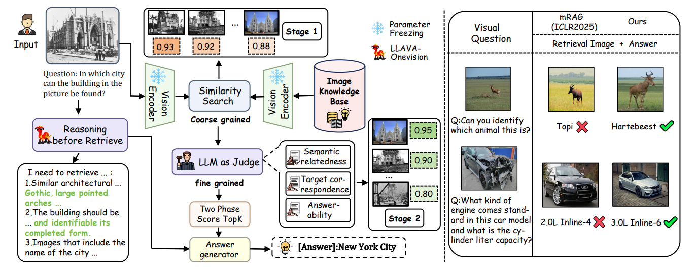

<div align="center">
  <h1>R<sup>3</sup>G: A Reasoning-Retrieval-Reranking Framework for Vision-Centric Answer Generation</h1>
</div>

<p align="center">
  
</p>

## Table of Contents
- [Overview](#overview)
- [Quick Start](#quick-start)
- [Roadmap](#roadmap)


## Overview
Vision- centric retrieval for VQA requires retrieving images to supply missing visual cues and integrating them into the reasoning process. However, selecting the right images and integrating them effectively into the model’s reasoning remains challenging. To address this challenge, we propose R3G, a modular Reasoning–Retrieval–Reranking framework. It first produces a brief reasoning plan that specifies the required visual cues, then adopts a two stage strategy, with coarse retrieval followed by fine grained reranking, to select evidence images. On MRAG-Bench, R3G improves accuracy across six MLLM backbones and nine sub-scenarios, achieving state-of-the-art overall performance. Ablations show that sufficiency aware reranking and reasoning steps are complementary, helping the model both choose the right images and use them well.


## Quick Start
### 1) Create environment `R3G` (Python 3.10)
```bash
conda create -n R3G python=3.10 -y
conda activate R3G
pip install -r requirements.txt
```

### 2) Download the dataset 
- HF dataset page: <https://huggingface.co/datasets/uclanlp/MRAG-Bench>
- Place the extracted data at a path of your choice, e.g.: `/MRAG/dataset/`
- Must include at least:
  - `mrag_bench_image_corpus/` (image corpus)

### 3) Download EVA‑CLIP weights
- HF weights page: <https://huggingface.co/QuanSun/EVA-CLIP>

### 4) Build the index 
```bash
python retrieval/build_universal_mrag_index.py
```


### 5) Stage‑1 retrieval and scoring 
```bash
python retrieval/retrieve.py
```


## Roadmap
- ✅ Flow diagram (overview.png)
- ✅ EVA‑CLIP + FAISS index building 
- ✅ Stage‑1 retrieval and scoring 
- ✅ Stage‑2 Prompt 
- ⏳ Stage‑2 scoring implementation (MLLM‑as‑Judge) — coming soon
- ⏳ R* (Reasoning‑Before‑Evidence) — coming soon
- ⏳ Answer generation and end‑to‑end evaluation — coming soon

