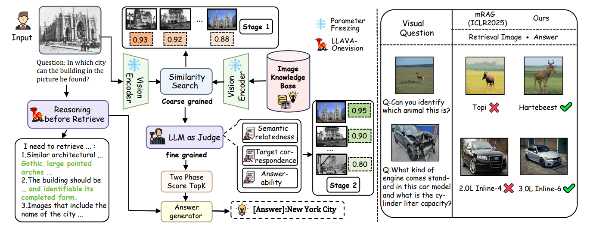

<div align="center">
  <h1>R<sup>3</sup>G: A Reasoning–Retrieval–Reranking Framework for Vision-Centric Answer Generation</h1>
</div>

<p align="center">
  
</p>

---

## Table of Contents
- [Overview](#overview)
- [Method](#method)
- [Repository Structure](#repository-structure)
- [Quick Start](#quick-start)
- [Roadmap](#roadmap)
- [Citation](#citation)

---

## Overview
Vision-centric question answering often requires retrieving external images to supply missing visual evidence that is not present in the query image alone. While prior retrieval-augmented approaches focus on retrieving visually similar images, they struggle to determine **which images are truly sufficient** and **how they should be used during reasoning**.

We propose **R³G**, a modular **Reasoning–Retrieval–Reranking** framework that explicitly models evidence selection as a multi-stage decision process.  
Given a query image and a question, R³G:
1. **Plans** what visual evidence is required via a reasoning-before-evidence step,
2. **Retrieves** candidate images using a coarse visual similarity search,
3. **Reranks** candidates with an MLLM-as-Judge that evaluates evidence sufficiency,
4. **Generates** the final answer by integrating selected evidence images.

On MRAG-Bench, R³G consistently improves performance across multiple MLLM backbones and diverse visual reasoning scenarios. Ablation studies show that reasoning guidance and sufficiency-aware reranking are complementary and jointly contribute to robust gains.

---

## Method
R³G decomposes vision-centric answer generation into three explicit stages:

**1) Reasoning (R)**  
A lightweight reasoning planner produces a short sequence of reasoning steps that specify *what visual cues are required* to answer the question.  
This step does **not** access retrieved images and serves as guidance for downstream evidence evaluation.

**2) Retrieval (R)**  
Candidate evidence images are retrieved from a large image corpus using EVA-CLIP embeddings and a FAISS index, providing a coarse but diverse candidate pool.

**3) Reranking (G)**  
An MLLM-as-Judge evaluates each candidate image against three criteria:
- **Semantic relatedness**
- **Target correspondence**
- **Answerability (evidence sufficiency)**

The final evidence image is selected by fusing retrieval similarity and judge scores, and is then used for answer generation.

---

## Repository Structure
```
R3G/
├── assets/
│   └── overview.png
├── llava/                 # LLaVA source code (used as backbone)
├── src/
│   ├── pipeline.py        # End-to-end R³G pipeline
│   ├── retrieve.py        # Image retrieval with EVA-CLIP + FAISS
│   ├── reasoning_generator.py  # Reasoning-before-evidence planner
│   ├── image_score.py     # MLLM-as-Judge (r/t/a scoring)
│   ├── image_choose.py    # Evidence fusion and selection
│   ├── image_answer.py   # Final answer generation
│   ├── prompt.py          # All prompts (planner / judge / answer)
│   ├── llava_utils.py     # Lightweight LLaVA loading utilities
│   └── run.sh             # Minimal execution script
├── README.md
└── .gitignore
```

All scripts are **path-agnostic**.  
Dataset paths and model checkpoints are configured **only** in `src/run.sh`.

---

## Quick Start

### 1) Create environment (Python 3.10)
```bash
conda create -n R3G python=3.10 -y
conda activate R3G
pip install -r requirements.txt
```

### 2) Prepare MRAG-Bench
- Dataset page: https://huggingface.co/datasets/uclanlp/MRAG-Bench
- Download and extract the dataset to a directory of your choice.
- Required components include:
  - Query images
  - Image corpus
  - Parquet annotation files

### 3) Prepare EVA-CLIP
- Download EVA-CLIP weights from: https://huggingface.co/QuanSun/EVA-CLIP
- Build a FAISS index over the image corpus using EVA-CLIP features.

### 4) Configure paths
Edit `src/run.sh` and set the following variables:
```bash
PARQUET_DIR=...
FAISS_INDEX=...
METADATA_PKL=...
QUERY_IMAGE_ROOT=...
EVA_MODEL_PATH=...
LLAVA_MODEL=...
OUTPUT_JSONL=...
```

### 5) Run R³G
```bash
cd src
bash run.sh
```

The pipeline produces a **single JSONL file** containing:
- question id
- predicted answer
- ground-truth answer
- selected evidence image

No intermediate files are written.

---

## Roadmap
- ✅ Overall framework and flow diagram
- ✅ EVA-CLIP + FAISS retrieval
- ✅ Reasoning-before-evidence planner
- ✅ MLLM-as-Judge reranking (r/t/a criteria)
- ✅ End-to-end answer generation
